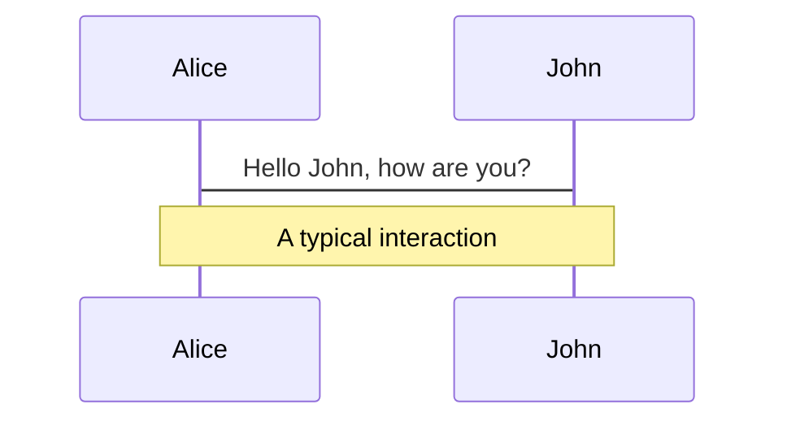
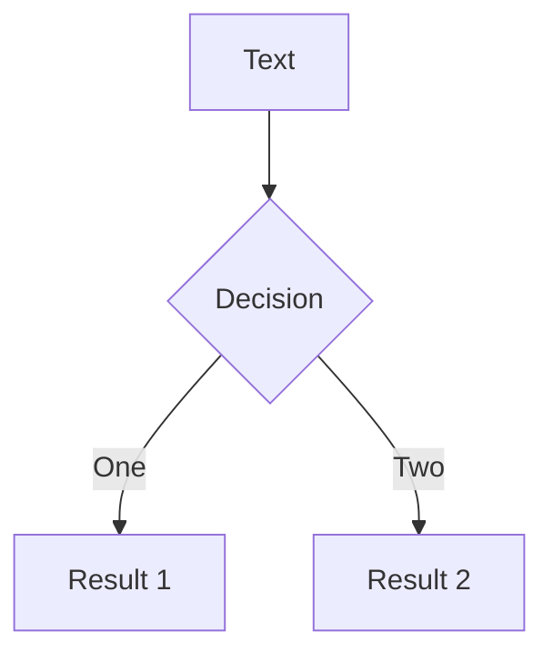
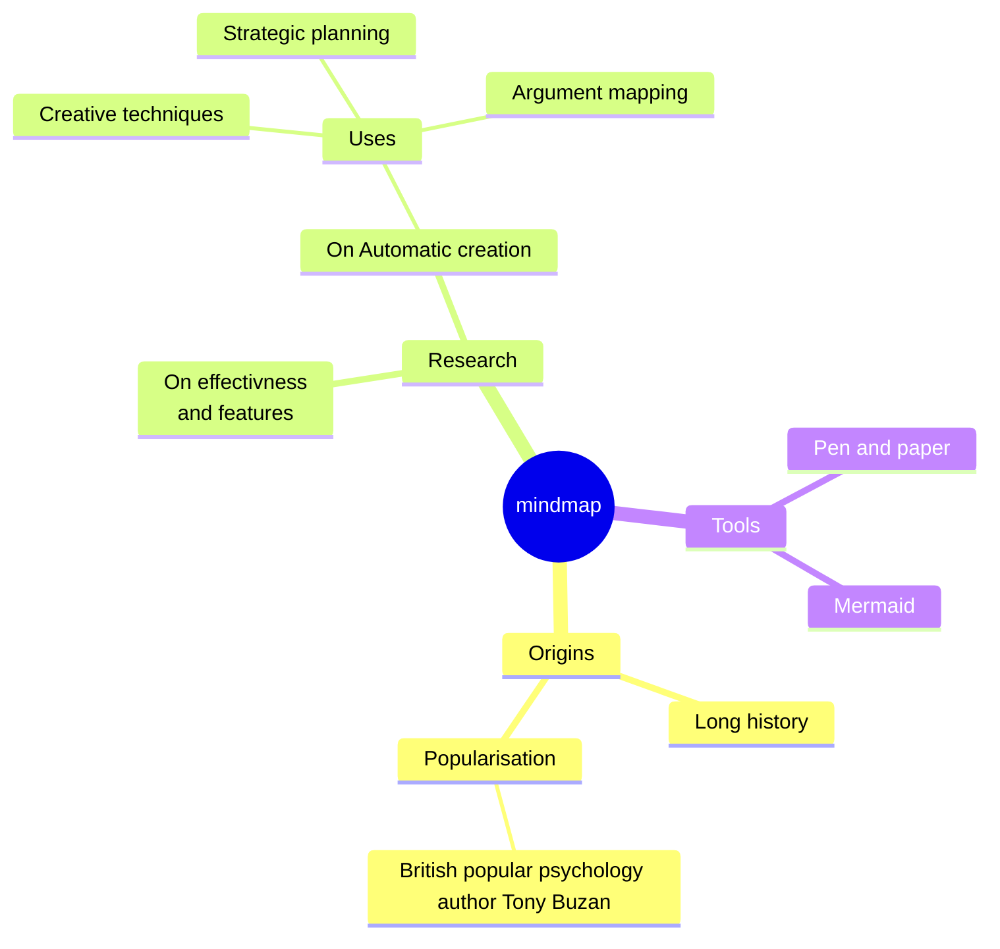
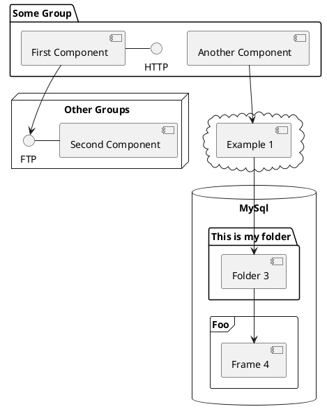

# VIM

從新手到入門，掌握VIM的基礎操作

<!--

VIM是一款古老但功能強大的文本編輯器，
它被廣泛用於許多作業系統中，
並在程式開發者和系統管理員之間受到高度使用，
但同時， 由於它獨特的操作方式，
VIM也經常被認為有一定的學習曲線。

今天，我們的目標是打破這個迷思，
讓每一位參加者都從VIM的新手成長為入門者。
無論你是完全的初學者，還是之前已有一些VIM的經驗，
都希望這次的分享可以為你提供有價值的指導。

在接下來的時間裡，
我們將深入探討VIM的基礎操作，
從最基礎的移動和編輯，
到稍微進階的搜尋、
替換和配置等功能。
還會分享一些實用的技巧和資源，
幫助你在VIM的世界中更加得心應手。

-->

---
transition: fade-out
---

# VIM是什麼?

文本編輯器的一種 在終端機中運行 適用於多種作業系統

- 📝 **功能強大的編輯器** - 它擁有許多高級功能，例如語法高亮、自動完成、以及強大的搜尋和替換功能
- 🎨 **終端機內運行** - 主要在終端機中運行，讓你在沒有圖形界面的伺服器上也能順利工作
- 🧑‍💻 **模式化操作** - VIM擁有多種操作模式，如一般模式、插入模式和命令模式，這讓你能更高效地進行編輯
- 🤹 **跨平台兼容** - 包括Linux、macOS和Windows，這使得它成為一款真正的跨平台編輯器
- 🎥 **擴展性強** - 通過插件，擴展功能，使其成為一個完整的開發環境，適合各種語言和工具的編碼工作
- 📤 **鍵盤導向操作** - 這可以極大地提高編輯效率，一旦習慣，你可能會發現鼠標反而變得多餘
- 🛠 **低資源消耗** - 運行時資源消耗相對低。即使在資源有限的伺服器或老舊設備上，也能夠流暢運行

<br>
<br>


<!--
You can have `style` tag in markdown to override the style for the current page.
Learn more: https://sli.dev/guide/syntax#embedded-styles
-->

<style>
h1 {
  background-color: #2B90B6;
  background-image: linear-gradient(45deg, #4EC5D4 10%, #146b8c 20%);
  background-size: 100%;
  -webkit-background-clip: text;
  -moz-background-clip: text;
  -webkit-text-fill-color: transparent;
  -moz-text-fill-color: transparent;
}
</style>

<!--
今天我們要探討的是一款古老但仍然強大的工具：VIM。VIM有哪些特點使其在眾多編輯器中脫穎而出呢？

首先，當我們談到功能強大時，VIM絕對是頂尖的。它不只是一個文本編輯器，更是一個裝滿了語法高亮、自動完成和強大搜尋替換功能的寶盒。

接著，VIM的獨特之處在於它主要在終端機中運行。這使得在無GUI的伺服器上工作時，VIM成為一個不可或缺的工具。

而VIM的模式化操作設計，如一般模式、插入模式和命令模式，確保了用戶能夠專注於當前的任務，提高編輯效率。

不僅如此，VIM的跨平台特性意味著你可以在幾乎任何作業系統上使用它，從Linux到Windows，再到macOS。

對於需要更多自定義功能的你，VIM的擴展性能完美滿足。透過插件系統，VIM可以變身為一個功能齊全的開發環境。

再者，VIM特別鼓勵鍵盤操作，這種鍵盤導向的設計可以極大地提高你的工作效率。熟練後，你會發現鼠標在VIM世界中幾乎是不必要的。

最後，對於那些在資源有限的環境中工作的用戶，VIM的低資源消耗是一大賣點。它保證了即使在老舊硬體或資源受限的伺服器上，你也能得到流暢的使用體驗。

總之，VIM綜合了許多出色的特點，使其不僅適合初學者，更受到專業開發者的喜愛。透過今天的分享，希望你能更加了解這款強大的編輯器。

-->

---
layout: cover
---
<h1 v-click-hide>
Why I Use Vim 
</h1>
<div v-after  class="left-50 top-60 absolute text-5xl opacity-30 transform -rotate-10"> And Why You Should Too </div>

<!--
今天我想和大家分享一下，為什麼我選擇使用Vim，以及為什麼我認為你們也應該考慮使用它。

首先，讓我們談談組合按鍵。大家可能都經歷過這樣的情境：在一款編輯器或軟體中，想要完成某項操作，卻要按好幾次鍵，甚至需要移動手去點擊鼠標。這時候，Vim的組合按鍵優勢就體現出來了。在Vim中，大部分的操作都可以通過簡單、直觀的組合按鍵來完成。例如，你想刪除一行、複製一段或者快速跳轉到某個位置，只需要簡單的按鍵組合即可。

這帶領我們到了下一點：Vim的操作是快捷且精準的。因為Vim的按鍵設計都是基於提高效率和精確度，所以一旦你習慣了Vim的操作，你會發現自己的編輯速度和效率大大提高。

再來，我要談的是Vim的導航優勢。在許多編輯器中，導航文件可能需要滑鼠滾輪、箭頭鍵或其他不太直觀的方法。但在Vim中，你可以輕鬆地在文件之間、行之間甚至是字符之間快速移動。而且，Vim還提供了許多強大的搜尋和跳轉功能，讓你可以在大型文件或專案中迅速找到所需的位置。

總結一下，我選擇使用Vim，是因為它的效率、精確度和導航優勢。而我認為，無論你是一名開發者、寫手還是任何需要大量編輯文本的專業人士，Vim都是一款值得你學習和使用的工具。
-->


---
transition: slide-up
level: 2
---

# 光標移動 
 Cursor movement


|  1. 基本光標移動:   | 5. 跳轉至特定行:    |       
| --- | --- | 
|   <kbd>h</kbd> / <kbd>j</kbd> / <kbd>k</kbd> / <kbd>l</kbd> | <kbd>G</kbd> / <kbd>gg</kbd> / <kbd>:&lbrack;number&rbrack; </kbd> |
|  2. 單詞移動: |6. 畫面移動:    |
|   <kbd>w</kbd>  / <kbd>W</kbd>  / <kbd>e</kbd>  / <kbd>E</kbd>  / <kbd>b</kbd>  / <kbd>B</kbd>  |<kbd>ctrl+f</kbd>  / <kbd>ctrl+b</kbd>  / <kbd>ctrl+u</kbd>  / <kbd>ctrl+d</kbd>  / <kbd>zz</kbd>  |
|  3. 行移動:| 7. 匹配括號跳轉:    |
|   <kbd>0</kbd> / <kbd>^</kbd> / <kbd>$</kbd>|<kbd>%</kbd>|
|  4. 段落和區塊移動 |   |
|   <kbd v-pre> <span v-pre>&lbrace;</span> </kbd>  / <kbd> <span v-pre>&rbrace;</span> </kbd>  / <kbd> <span v-pre>&lbrack;</span> </kbd>  / <kbd> <span v-pre> &rbrack; </span> </kbd>| |

<!-- https://sli.dev/guide/animations.html#click-animations -->


<style>
h1 {
  background-color: #2B90B6;
  background-image: linear-gradient(45deg, #4EC5D4 10%, #146b8c 20%);
  background-size: 100%;
  -webkit-background-clip: text;
  -moz-background-clip: text;
  -webkit-text-fill-color: transparent;
  -moz-text-fill-color: transparent;
}
</style>

<!--

[講稿在下面]

1. 基本光標移動:
h: 向左移動一個字符。
j: 向下移動一行。
k: 向上移動一行。
l: 向右移動一個字符。

2. 單詞移動:
w: 移動到下一個單詞的開始。
W: 移動到下一個單詞的開始（考慮標點符號）。
e: 移動到當前單詞的結尾。
E: 移動到當前單詞的結尾（考慮標點符號）。
b: 移動到前一個單詞的開始。
B: 移動到前一個單詞的開始（考慮標點符號）。

3. 行移動:
0: 移動到行首。
^: 移動到當前行的第一個非空白字符。
$: 移動到行尾。
4. 段落和區塊移動:
{: 向上移動到上一個段落的開始。
}: 向下移動到下一個段落的結尾。
[: 向上移動到同一級的上一個區塊。
]: 向下移動到同一級的下一個區塊。

5. 跳轉至特定行:
G: 移動到文件的最後一行。
gg: 移動到文件的第一行。
:[number]: 移動到文件的第[number]行。

6. 畫面移動:
Ctrl + f: 向前滾動一屏。
Ctrl + b: 向後滾動一屏。
Ctrl + u: 向上滾動半屏。
Ctrl + d: 向下滾動半屏。
zz: 將當前行置於畫面中央。

7. 匹配括號跳轉:
%: 跳轉到匹配的括號、中括號或大括號。

[講稿]

今天我要介紹的是Vim中的光標移動。學會這些移動技巧可以大大提高你在Vim中的效率。

首先，我們從基本光標移動開始：

使用 h, j, k, l 你可以在文件中四處移動，就像遊戲中的上下左右按鍵一樣。
接著是單詞移動：

w 和 W 讓你跳至下一個單詞的開始，而 e 和 E 則移動到單詞的結尾。如果想回到前一個單詞，就使用 b 或 B。
針對行移動，我們有：

0 移動至行首，^ 跳到該行的第一個非空白字符，而 $ 則是跳至行尾。
接下來是段落和區塊移動：

使用 { 和 } 可以在段落之間快速跳轉，而 [ 和 ] 則是在區塊間移動。
要快速跳到文件的某一行，你可以使用跳轉至特定行的命令：

G 會跳至文件尾，gg 則跳至文件頭，如果你想跳到特定的行數，例如第10行，只需輸入 :10。
對於畫面移動，我們有以下命令：

Ctrl + f 和 Ctrl + b 分別向前和向後滾動整個畫面；Ctrl + u 和 Ctrl + d 則是滾動半個畫面；而 zz 則是將當前行置於畫面中央。
最後，當你在處理有括號的代碼時，% 允許你在匹配的括號間跳轉。

這就是Vim中的光標移動命令。希望透過今天的分享，你能夠更加熟練地在Vim中移動和編輯。
-->


---
transition: slide-up
level: 2
layout: image-right
image: https://source.unsplash.com/collection/94734566/1920x1080
---

# Cursor movement

區塊移動

## Key binding 

|     |     |     |  
| --- | --- | --- |
| <kbd>h</kbd> / <kbd>j</kbd> / <kbd>k</kbd> / <kbd>l</kbd> | 位移：左, 下, 上, 右| 基本模式 |
| <kbd>w</kbd>  / <kbd>W</kbd>  / <kbd>e</kbd>  / <kbd>E</kbd>  / <kbd>b</kbd>  / <kbd>B</kbd>  | 光標移動(單字) | 基本模式 |


<!-- https://sli.dev/guide/animations.html#click-animations -->

<!--


-->


---
layout: image-right
image: https://source.unsplash.com/collection/94734566/1920x1080
---

# Code

Use code snippets and get the highlighting directly![^1]

```ts {all|2|1-6|9|all}
interface User {
  id: number
  firstName: string
  lastName: string
  role: string
}

function updateUser(id: number, update: User) {
  const user = getUser(id)
  const newUser = { ...user, ...update }
  saveUser(id, newUser)
}
```

<arrow v-click="[3, 4]" x1="400" y1="420" x2="230" y2="330" color="#564" width="3" arrowSize="1" />

[^1]: [Learn More](https://sli.dev/guide/syntax.html#line-highlighting)

<style>
.footnotes-sep {
  @apply mt-20 opacity-10;
}
.footnotes {
  @apply text-sm opacity-75;
}
.footnote-backref {
  display: none;
}
</style>

---

# Components

<div grid="~ cols-2 gap-4">
<div>

You can use Vue components directly inside your slides.

We have provided a few built-in components like `<Tweet/>` and `<Youtube/>` that you can use directly. And adding your custom components is also super easy.

```html
<Counter :count="10" />
```

<!-- ./components/Counter.vue -->
<Counter :count="10" m="t-4" />

Check out [the guides](https://sli.dev/builtin/components.html) for more.

</div>
<div>

```html
<Tweet id="1390115482657726468" />
```

<Tweet id="1390115482657726468" scale="0.65" />

</div>
</div>

<!--
Presenter note with **bold**, *italic*, and ~~striked~~ text.

Also, HTML elements are valid:
<div class="flex w-full">
  <span style="flex-grow: 1;">Left content</span>
  <span>Right content</span>
</div>
-->


---
class: px-20
---

# Themes

Slidev comes with powerful theming support. Themes can provide styles, layouts, components, or even configurations for tools. Switching between themes by just **one edit** in your frontmatter:

<div grid="~ cols-2 gap-2" m="-t-2">

```yaml
---
theme: default
---
```

```yaml
---
theme: seriph
---
```


</div>

Read more about [How to use a theme](https://sli.dev/themes/use.html) and
check out the [Awesome Themes Gallery](https://sli.dev/themes/gallery.html).

---
preload: false
---

# Animations

Animations are powered by [@vueuse/motion](https://motion.vueuse.org/).

```html
<div
  v-motion
  :initial="{ x: -80 }"
  :enter="{ x: 0 }">
  Slidev
</div>
```

<div class="w-60 relative mt-6">
  <div class="relative w-40 h-40">
    
    
    
  </div>

  <div
    class="text-5xl absolute top-14 left-40 text-[#2B90B6] -z-1"
    v-motion
    :initial="{ x: -80, opacity: 0}"
    :enter="{ x: 0, opacity: 1, transition: { delay: 2000, duration: 1000 } }">
    Slidev
  </div>
</div>

<!-- vue script setup scripts can be directly used in markdown, and will only affects current page -->
<script setup lang="ts">
const final = {
  x: 0,
  y: 0,
  rotate: 0,
  scale: 1,
  transition: {
    type: 'spring',
    damping: 10,
    stiffness: 20,
    mass: 2
  }
}
</script>

<div
  v-motion
  :initial="{ x:35, y: 40, opacity: 0}"
  :enter="{ y: 0, opacity: 1, transition: { delay: 3500 } }">

[Learn More](https://sli.dev/guide/animations.html#motion)

</div>

---

# LaTeX

LaTeX is supported out-of-box powered by [KaTeX](https://katex.org/).

<br>

Inline $\sqrt{3x-1}+(1+x)^2$

Block
$$ {1|3|all}
\begin{array}{c}

\nabla \times \vec{\mathbf{B}} -\, \frac1c\, \frac{\partial\vec{\mathbf{E}}}{\partial t} &
= \frac{4\pi}{c}\vec{\mathbf{j}}    \nabla \cdot \vec{\mathbf{E}} & = 4 \pi \rho \\

\nabla \times \vec{\mathbf{E}}\, +\, \frac1c\, \frac{\partial\vec{\mathbf{B}}}{\partial t} & = \vec{\mathbf{0}} \\

\nabla \cdot \vec{\mathbf{B}} & = 0

\end{array}
$$

<br>

[Learn more](https://sli.dev/guide/syntax#latex)

---

# Diagrams

You can create diagrams / graphs from textual descriptions, directly in your Markdown.

<div class="grid grid-cols-4 gap-5 pt-4 -mb-6">









</div>

[Learn More](https://sli.dev/guide/syntax.html#diagrams)

---
src: ./pages/multiple-entries.md
hide: false
---

---
layout: center
class: text-center
---

# Learn More

[Documentations](https://sli.dev) · [GitHub](https://github.com/slidevjs/slidev) · [Showcases](https://sli.dev/showcases.html)
